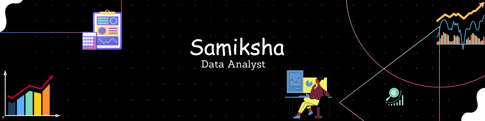

<h1 align="center">Hi 👋, I'm Samiksha</h1>
<h3 align="center">A passionate Data Analyst from India</h3>

- 🔭 I’m currently working on **Sharpe my Communication Skill**

- 🌱 I’m currently learning **Machine Learning**

- ⚡Overview **Welcome to my Data Analyst portfolio! This repository houses a collection of projects and resources that demonstrate my skills and expertise in data analysis. I've developed and curated**

<h3 align="left">Connect with me:</h3>

<h3 align="left">Languages and Tools:</h3>

        

<!--

-->

